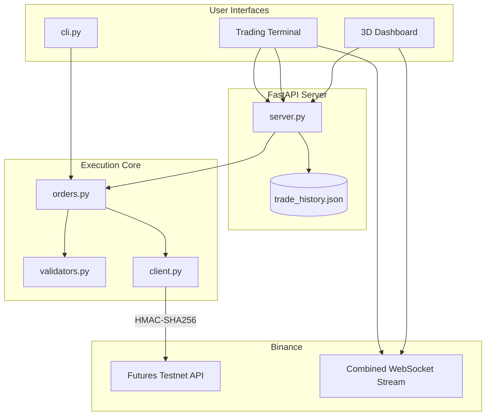

<!-- ====== START ATTRACTIVE README.md ====== -->

<div align="center">

# 🚀🌌 Binance Futures 3D Interactive Terminal

<!-- BIG BANNER ASCII ART -->
<pre>
    ██████╗ ██╗███╗   ██╗ █████╗ ███╗   ██╗ ██████╗███████╗
    ██╔══██╗██║████╗  ██║██╔══██╗████╗  ██║██╔════╝██╔════╝
    ██████╔╝██║██╔██╗ ██║███████║██╔██╗ ██║██║     █████╗  
    ██╔══██╗██║██║╚██╗██║██╔══██║██║╚██╗██║██║     ██╔══╝  
    ██████╔╝██║██║ ╚████║██║  ██║██║ ╚████║╚██████╗███████╗
    ╚═════╝ ╚═╝╚═╝  ╚═══╝╚═╝  ╚═╝╚═╝  ╚═══╝ ╚═════╝╚══════╝
</pre>

**⚡ QUANT FUTURE TERMINAL — MULTI‑DIMENSIONAL WEBGL VIEWPORT ⚡**

<!-- BADGES ROW -->


[](https://opensource.org/licenses/MIT)
[](https://github.com/yourusername/trading_bot)
[](https://discord.gg/yourinvite)
[](https://twitter.com/yourhandle)

<!-- TYPING ANIMATION -->


</div>

---

> [!IMPORTANT]
> **Core Deliverable (CLI Trading Client)**: The primary evaluated interface is located in [cli.py](file:///c:/Users/hp/OneDrive/Desktop/Trading%20Bot/cli.py). To place testnet futures orders instantly, run:
> ```bash
> python cli.py --symbol BTCUSDT --side BUY --type MARKET --quantity 0.01
> ```

---

## 📖 Table of Contents
- [💡 What is "Binance"?](#-what-is-binance)
- [✨ Features](#-features)
- [🛠️ Tech Stack](#%EF%B8%8F-tech-stack)
- [📝 Assumptions & Design Choices](#-assumptions--design-choices)
- [🌟 Visual Highlights](#-visual-highlights)
- [🔧 Internal Mechanics & Security](#-internal-mechanics--security)
- [📁 Repository Structure](#-repository-structure)
- [📐 Architecture & Data Flow](#-architecture--data-flow)
- [⚙️ Installation & Setup](#%EF%B8%8F-installation--setup)
- [💻 Running CLI Orders](#-running-cli-orders)
- [🌐 Launching the 3D Web UI](#-launching-the-3d-web-ui)
- [🧪 Testing](#-testing)
- [🐳 Docker Deployment](#-docker-deployment)
- [🤝 Contributing](#-contributing)
- [📄 License](#-license)

---

## 💡 What is "Binance"?

The word **Binance** is a portmanteau (blend) of **Binary** and **Finance**:
* **Binary** – the digital, computational foundation of cryptocurrency, cryptography, and blockchain.
* **Finance** – the global systems of exchange, investment, capital, and asset trading.

Together, the brand name signifies the **union of computer technology and global asset trading**—the conceptual bedrock of this interactive terminal dashboard.

---

## ✨ Features

- [x] **3D WebGL Dashboard** – Orbit around a live‑animated crypto coin with reactive particles.
- [x] **Real‑Time WebSocket Feeds** – Live mark prices and 24h changes for BTC, ETH, SOL.
- [x] **Secure HMAC‑SHA256 Signing** – All requests to Binance Futures Testnet are signed.
- [x] **CLI & Web UI** – Trade from the terminal or the interactive dashboard.
- [x] **Demo Mode** – No API keys? No problem – mock trading with $10,000 USDT.
- [x] **Persistent Trade Journal** – All orders are saved locally in `logs/trade_history.json`.
- [x] **Docker Ready** – Spin up the whole stack with one command.

---

## 🛠️ Tech Stack

<div align="center">
  
</div>

| Layer | Technology |
| :--- | :--- |
| **Frontend UI** | HTML5, Glassmorphic CSS3, ES6, FontAwesome |
| **3D Rendering** | Three.js (WebGL, OrbitControls, particle system) |
| **Real‑Time Data** | WebSockets (`wss://fstream.binance.com`) |
| **Backend API** | Python 3.8+, FastAPI, Uvicorn |
| **Exchange Client** | Custom Requests wrapper with HMAC‑SHA256 |
| **Persistence** | Local JSON (`logs/trade_history.json`) |
| **Validation** | Regex & custom rules (`bot/validators.py`) |
| **Logging** | Rotating file handler + console output |

---

## 📝 Assumptions & Design Choices

- **Default TIF**: All Limit/Stop‑Limit orders use `GTC` (Good 'Til Cancelled).
- **Quantity Precision**: Order sizes respect each symbol's asset precision (BTC: 3 decimals, ETH: 2, SOL: 1).
- **Stop‑Limit Translation**: The API client converts `STOP_LIMIT` → `STOP` for Binance compatibility.
- **Demo Fallback**: Missing credentials → automatic Demo Mode with $10,000 USDT.
- **Order Journal**: Every order is recorded in `logs/trade_history.json` for audit.

---

## 🌟 Visual Highlights

### 🎮 Central 3D Canvas
- **Glow‑Grid Highway**: Animated grid that scrolls like a blockchain data stream.
- **3D Token**: A metallic golden/cyan coin that spins and pulses with market activity.
- **Particle Feedback**:
  - **LONG (BUY)** → green shockwave + neon green particles flying upward.
  - **SHORT (SELL)** → pink shockwave + neon red particles falling down.
  - The coin spins wildly during order execution, then slows down.

### 🖥️ Terminal Console & Journal
- **Engine Logs**: Real‑time scrolling console that tails `trading_bot.log` with colour‑coding.
- **Trade Journal**: Displays recent orders with status badges, updated dynamically from the local DB.

---

## 🔧 Internal Mechanics & Security

- **WebSocket Feed**: Direct browser connection to Binance combined streams – no server overhead.
- **Persistent DB**: All trades stored in `logs/trade_history.json`; exposed via `/api/journal`.
- **HMAC‑SHA256 Signing**: Parameters are hashed with the secret key and sent in `X‑MBX‑APIKEY`.
- **Server Time Sync**: Automatically adjusts timestamps to prevent `-1021 Out of Sync` errors.
- **Validation Middleware**: Symbol, type, quantity, and price constraints checked server‑side.
- **Demo Mode**: Zero‑setup simulation with mock tickers and balance – perfect for testing.

---

## 📁 Repository Structure

```text
trading_bot/
├── bot/                  # Core engine
│   ├── client.py         # REST client & signing
│   ├── orders.py         # Order placement
│   ├── validators.py     # Input validation
│   └── logging_config.py # Logging setup
├── frontend/             # 3D UI
│   ├── index.html        # Main dashboard
│   ├── style.css         # Glassmorphic styles
│   ├── app.js            # Three.js & WebSocket
│   ├── terminal.html     # Trading terminal overlay
│   ├── terminal.css      # Dark grid panel styles
│   └── terminal.js       # Chart & depth book
├── logs/                 # Auto‑generated logs
│   └── trading_bot.log
├── tests/                # Unit tests
├── cli.py                # Command‑line interface
├── server.py             # FastAPI server
├── requirements.txt
├── Dockerfile
├── docker-compose.yml
├── .env.example
└── README.md
```

---

## 📐 Architecture & Data Flow



---

## ⚙️ Installation & Setup

### 1️⃣ Clone & Virtual Environment
```powershell
git clone https://github.com/yourusername/trading_bot.git
cd trading_bot
py -m venv venv
.\venv\Scripts\Activate.ps1   # Windows PowerShell
pip install -r requirements.txt
```

### 2️⃣ API Credentials (Optional)
Copy `.env.example` → `.env` and add your [Testnet keys](https://testnet.binancefuture.com).  
If you skip this, the app runs in **Demo Mode**.

---

## 💻 Running CLI Orders

| Command | Description |
| :--- | :--- |
| `python cli.py --test-connection` | Ping the API |
| `python cli.py --symbol BTCUSDT --side BUY --type MARKET --quantity 0.01` | Market BUY |
| `python cli.py --symbol ETHUSDT --side SELL --type LIMIT --quantity 0.5 --price 3500` | Limit SELL |
| `python cli.py --symbol SOLUSDT --side BUY --type STOP_LIMIT --quantity 1.0 --price 152 --stop-price 150` | Stop‑Limit BUY |

---

## 🌐 Launching the 3D Web UI

```powershell
uvicorn server:app --reload
```
Then open **http://localhost:8000** in your browser.

### 🖱️ Interactive Walkthrough
- **Orbit**: Drag the 3D scene to rotate.
- **Order Form**: Choose symbol, side, type, and quantity → click **EXECUTE ORDER**.
- **Popup**: Receive instant feedback with order ID and fill price.
- **Log Terminal**: Scrolls live logs from the server.

---

## 🧪 Testing

Run the full test suite:
```powershell
python -m unittest discover -s tests
```

---

## 🐳 Docker Deployment

Spin up the whole stack in seconds:
```bash
docker compose up -d
```
Visit **http://localhost:8000** – logs are persisted in `./logs` via volume mount.

---

## 🤝 Contributing

Contributions are welcome! Please open an issue or pull request.  
For major changes, discuss them first.

---

## 📄 License

Distributed under the MIT License. See `LICENSE` for more information.

---

<div align="center">

### 🌟 Loved this project? Give it a star! ⭐

[](https://github.com/yourusername/trading_bot)
[](https://github.com/yourusername/trading_bot/fork)

**Built with ❤️ for Quant Traders & Developers**

</div>

<!-- ====== END ATTRACTIVE README.md ====== -->
